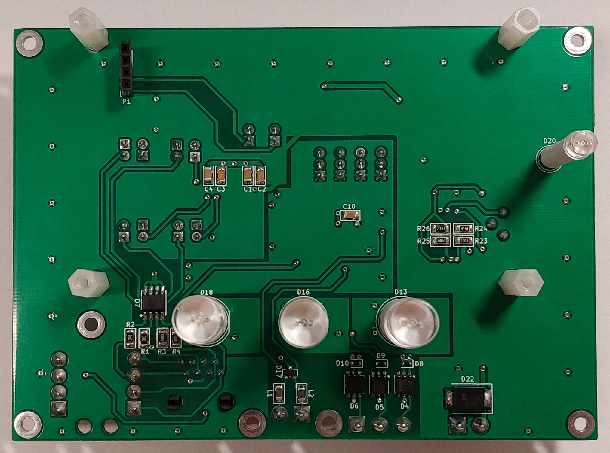
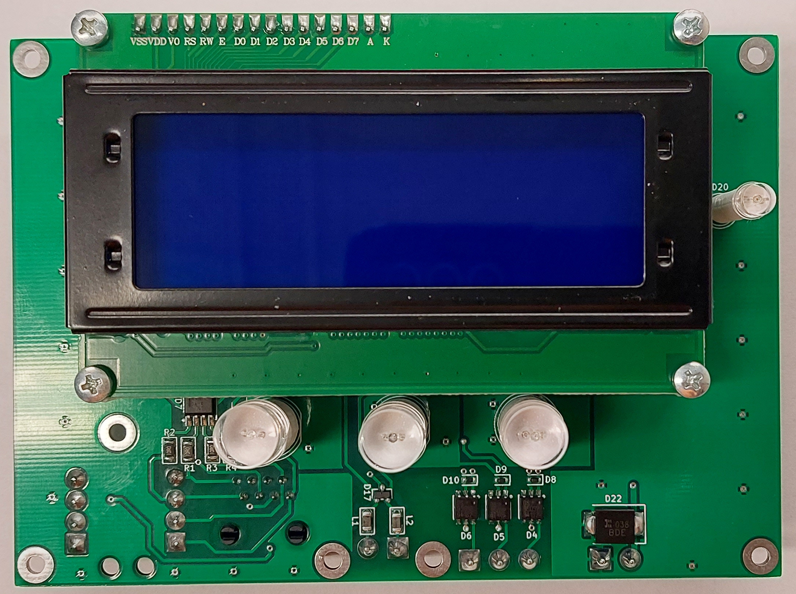
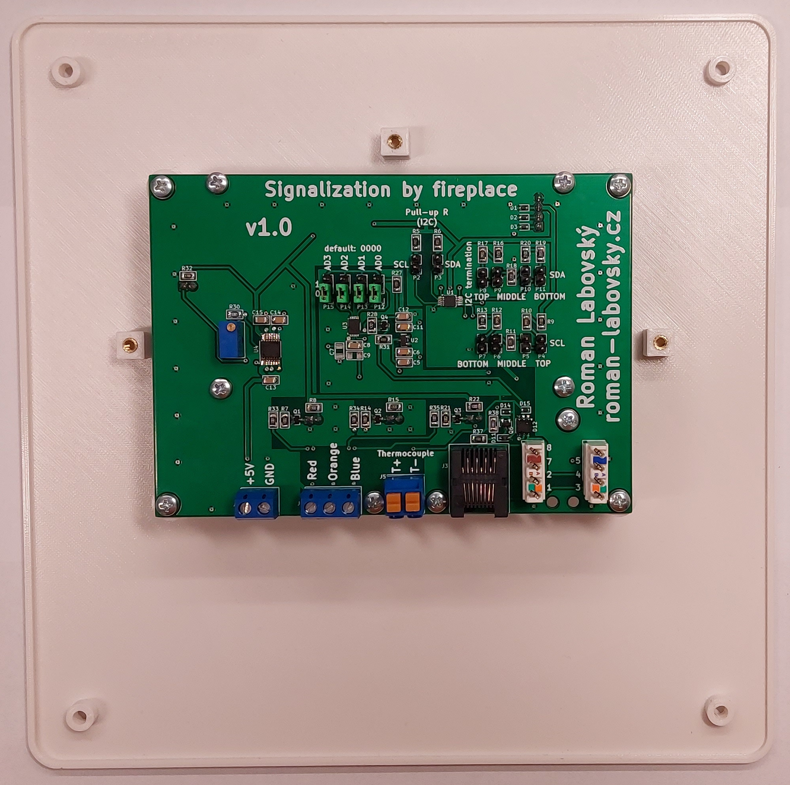
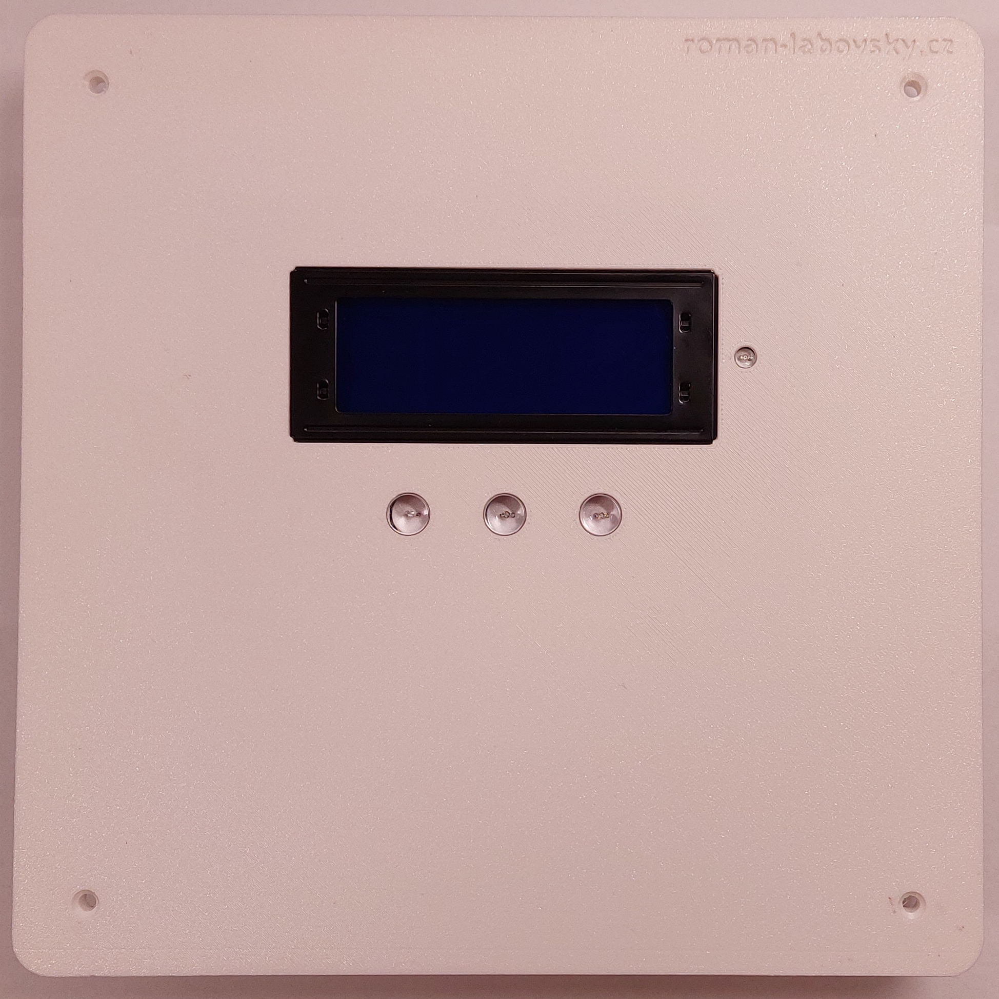
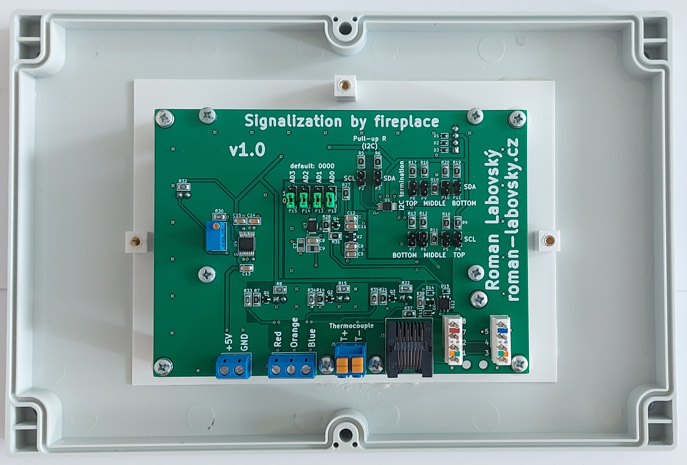
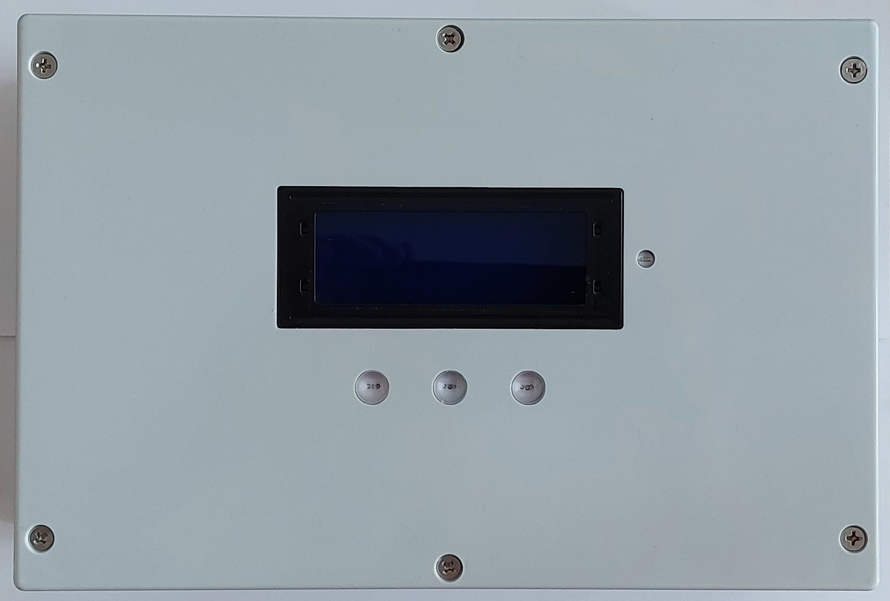

# System for underfloor heating v2.0

The system for regulation of zone heating of family house. Proposed control system is based on Raspberry Pi with the Home Assistant system. The unit is fully controllable via web. Devices for controlling individual parts of the heating zone control and local room temperature sensors were selected or made within the system.

## Description of overall concept
There is a heating system of house in the picture 1. The source of heat is fireplace in cellar, on the ground floor and on the first floor. All the fireplaces have a heat exchanger. The fireplaces with heat exchanger is for heating of heating water which flows through insert of fireplace. This insert of fireplace recharges hot water tank (HWT). In the ground floor and in the first floor is distributor of underfloor heating with 12 heating circuit. Every the heating circuit is possible to control independent. There is pump and manual three-way mixing valve for settings optimal temperature into underfloor heating. The first source of heat is gas condensing boiler, which is not currently installed. This gas boiler will use for heating of heating water in the summer season (for heating of domestic hot water (DHW)), where the fireplaces will not to use. The both source of heat are for heating of heating water into central tank (volume us 1 500 l). In the upper one third of the height of the tank is installed container for DHW (volume is 120 l). The system controls pumps at the distributors of underfloor heating, the pumps for fireplaces with exchanger and drives for individual circuit of underfloor heating. If there is request for heating from a room, the pumps will be controlled. If some makes a fire in fireplace, the selected pump at the fireplace will be turn on.

Picture 1: Heating system in the house.

### Hardware part
There is hardware concept in the picture 2.

Picture 2: Hardware part.

Central control unit is single board computer. 

Wireless wall-mounted room temperature sensors (WRTS) are powered from local poer adapter, every module has own supply. WRTS is consisted from display for showing current temperature and required temperature and other settings. There are 3 buttons, one is for input into menu, first is for increase temperature required and last is for decrease temperature. The last part is temperature sensor. WRTS communicates with central control unit via WiFi through WiFi router.

Cable wall-mounted room temperature sensors (WRTS) are powered from switch with POE. All parts are same as Wireless WRTS. Cable WRTS communicates with central control unit via POE switch.

The status indicator is connect with central control unit. It is composite from LED for individually temperatures, which are measured from individually parts in HWT. There is bus for communication with LCD and central control unit for showing temperatures from tank. The status indicators are located at fireplace.

Switches unit is composite  from relay module for control individually pumps for circulation heating water into heating circuit of underfloor heating in individually floors. There is controlling for pumps for circulation of water from fireplace exchanger. Last control is for gas boiler.

Zone controller si located in the ground floor and in the first floor in distributor for individually heating circuit. The cone controller communicates with central control unit via bus. The zone controller control individually drives, the drives control individually heating circuits. The drives are connected directly into zone controller.

Networdk devices are composite from central switch, switch with POE abd home WiFi router. The central switch merge all communication from cable WRTSs and from wireless WRTSs.

The temperature sensors in HWT are deployed in three parts of tank (top, middle and bottom part). There are temperatures sensor in smoke flues at individually fireplaces for detection of heating in a fireplace. 

### Communication part
There is communication concept in the picture 3.

Picture 3: Communication part.

The communication between central control unit and wireless/cable WRTS is via protocol MQTT. The central control unit receives information from individual WRTS. Some settings for WRTS is possible to change in the central control unit and sends this settings into WRTS.

The status indicators communicates with the central control unit via I2C bus for showing values on a display. Indicated LED are connect in input/output pins of the central control unit.

The switching unit is connect with the central control unit for control of pumps underfloor heating, pumps for fireplace exchangers and gas condensing boiler.

The zone controller communicates with the central control unit via I2C bus. The zone controller controls heating circuits.

The temperature sensors are located in HWT, in smoke flue of fireplaces and outdoor temperature. All sensors communicate  with the central control unit via 1-Wire bus.

## Hardware part
In the picture 4 is drawing of heating system with individual devices for control this system. In the text are descripted individual selected or designed devices whic are descripted in the drawing. In the text is description of WRTS.

Picture 4: The Heating system in the house including control electronics.

### Central control unit Raspberry Pi
In the picture 5 is cutout of part from all drawing (picture 4) for central controll unit. The central control unit is Raspberry Pi model 4b.

Picture 5: Coutout from picture 4 – the central control unit.

### Temperature sensors

Picture 6: Coutout from picture 4 – location of temperature sensors at fireplace.

In the picutre 6 is cutout of part from all drawing (picture 4) for location temperature sensors at a fireplace flue. For getting temperature from  the fireplace flue is termocouple 72-21301041 type K from manufacture Güenther.
The temperature range is from -100 °C to 400 °C. The termocouple is in the picture 8.

Picture 7: Coutout from picture 4 – location of temperature sensors in the heating water tank.

In the picutre 7 is cutout of part from all drawing (picture 4) for location temperature sensor in the HWT. Pro getting temperature from central HWT, outdoor temperature and room temperature from individual rooms is temperature sensor DS18B20 from manufacture Maxim. The temperatue range is from -55 °C to +125 °C. It is used sensors in a package TO-92 for WRTS, for HWT and oudoor temperature is sensor stored into protection package.

Obrázek 8: Termočlánek 72-21301041 typu K.

#### 1-Wire bus
The 1-Wire bus is implemented via UTP cable category 5e. 

Picture 9: Coutout from picture 4 – location of merge 1-Wire bus at the HWT.

In the picutre 9 is cutout of part from all drawing (picture 4) for association 1-Wire bus at HWT. In the picture 10 is PCB for temperature sensor at HWT. In the picutre 4.6b is top part PCB which is located in the installation box. There are 6 position for fastening via terminal block for temperature sensors. There are 3 temperature sensors connect for getting temperature from top, middle and bottom part HWT. The location of sensor is given manufacture of tank and sensors are inserted into cavity. The 1-Eier bus is implemented with UTP cable category 5e. The pin 4 is Data, pin 5 is GND and 3 pin is supply voltage. For getting outdoor temperature is sensor DS18b20 in the package TO-92 which is attached on the UTP cable and sealed off plastic material, which is covered with shrink protective tube. In the picuter 11 are marked places with location of temperature sensors. 

Obrázek 10: Sdružení 1-Wire sběrnice u ZOV.

Obrázek 11: ZOV – červené kroužky označují umístění teplotních senzorů.

### I2C bus
Obrázek 12: Výřez z obrázku 4 – modul I2C sběrnice u centrální jednotky

In the picutre 12. is cutout of part from all drawing (picture 4) for modul I2C bus at central control unit. The I2C bus is realized with integrated circuit PCA9615 from manufacture NXP Semiconductors. The signal SCL and SDA is connected directly from the central control unit into input PCA9615, supply voltage is 3.3 V. The output from PCA9615 is differential signal. The power supply on this side is 5 V. The bus is implemented via UTP cable category 5e, output form PCA9615 is implemented  via RJ45 connector. The UTP cable and differential transmission enable reach a long distance bus. The longest point of bus is about 30 m. The frequency used is 100 kHz. It is therefore a full-fledged I2C bus.
The reason for choosing this variant was based on the choice of a display with an I2C bus (simple and cheap solution), furthermore, it is a classic connection of the display, as if it were located at a small distance from the central unit and it is not necessary transfer as RS485 to UART and then to I2C bus. The communication is defined via I2C protokol. The one PCA9615 is located at central control unit and other PCA9615 are located at the ends of the end devices.
The power supply 5 V is implemented via separate cable. In the one UTP is 1-Wire bus and I2C bus - saving cables. 

## Signalization by fireplace

Picture 13: Coutout from picture 4 – signalization by fireplace.

In the picutre 13 is cutout of part from all drawing (picture 4) for signalization of status by fireplace. The PCB is composed from electronic fuse TPS2600 for protection 5 V. All input/output connectors have ESD protection (TVS diodes). The 1-Wire and I2C bus are connected vis UTP cable (connector RJ45). There are terminal blocks for LED signalization of accumulated HWT. Tthe blue LED is for top part of tank, the orange LED is for middle part of tank and the red LED is for bottom part of tank.

Temperature measurement using a thermocouple and a MAX31850K converter
The temperature sensors connected to the flues of the fireplace are implemented using a thermocouple. Tthe termocouple is connected to integrated circuit MAX31850K, value from the thermocouple is transferred into digital value including low temperature compensation end and this value is send via 1-Wire bus. The thermocouple is type K.

### LCD display
For showing temperatures from bottom, middle and top part of HWT was selected 20 characters and 4 rows LCD display with blue backlight and white letters, the picture 14. The HD44780 controller is used to control the display. An I2C expander PCF8574 is connected to the controller with eight outputs, whicj are connected on data bus for control respectively displaying the character on the display. Each display, or PCF8574 expander, allows you to set a unique device address on the bus using jumpers A0, A1, A2.

Picture 14: LCD display for displaying of temperatures from HWT. Rear and top part of LCD.

### Realized PCB of signalization by fireplace

Picture 15: Realized PCB of signalization by fireplace. The bottom part of PCB without the LCD, the bottom part of PCB with the LCD and the top part of PCB.

### Installation box
**Type 1**

It is used a [installation box](https://eshop.sez-cz.cz/e-shop/3597-universalni-krabice-pod-omitku-200x200x70mm?cat_id=129) (SEZ manufacturer, EAN 8585027005075) only (orange) rear part. The top part is printed from 3D printer.

All electronics are located in a protective installation box (picture 16). The box includes two wires for voltage 5 V and ground, three cables for controlling the signaling LEDs, a UTP cable with a 1-Wire bus for the temperature sensor (thermocouple) and an I2C bus.

Picture 16: The panel type 1. The panel with bottom PCB. The panel with top PCB. All installation by a fireplace.

**Type 2**

It is used a [installation box](https://www.gme.cz/v/1511578/u-01-26-instalacni-krabice) (Vigan manufacturer, EAN 90317), the picture 17. The holder for PCB top printed from 3D printer. This printed part is pasted with epoxy adhesive.

Picture 17: The panel type 2. The panel with bottom PCB. The panel with top PCB.

---
 [More pictures](/photos-of-final-products/signalization-by-fireplace)

---
**PCB and 3D models:**

* [PCB in KiCAD, Gerber data, …](https://github.com/RomLab/pcb-system-for-underfloor-heating-v2.0/tree/main/zone-controller)
* [3D models of box in FreCAD, STEP files, GCODE for Prusa's printer, …](https://github.com/RomLab/3d-model-system-for-underfloor-heating-v2.0/tree/main/zone-controller)

---

