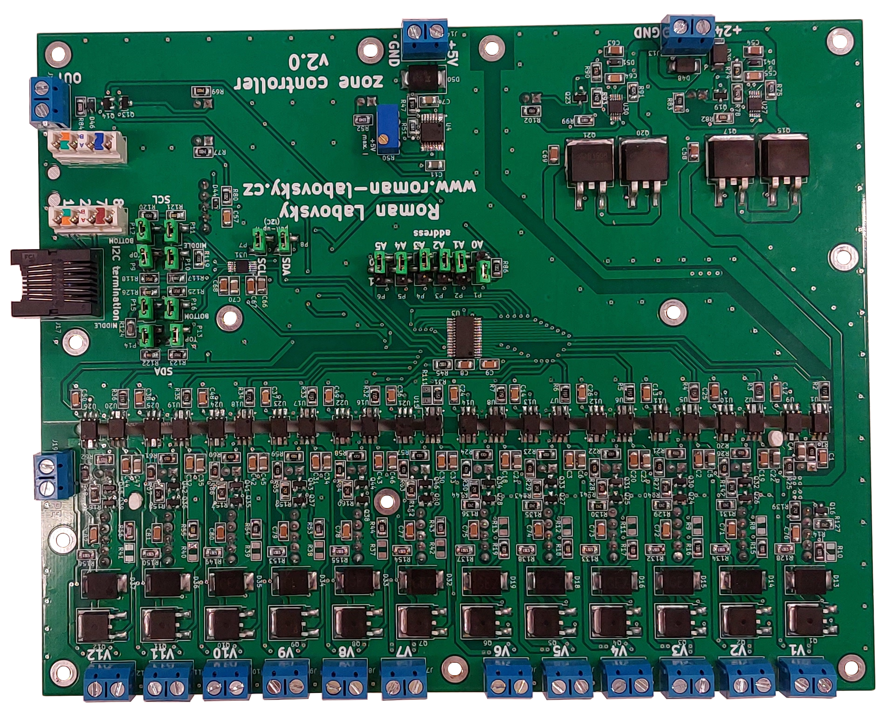
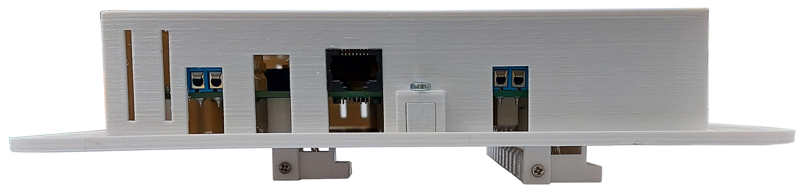
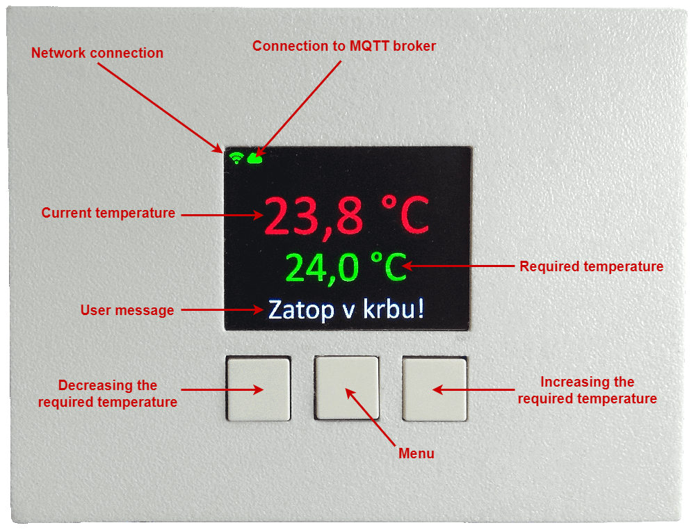
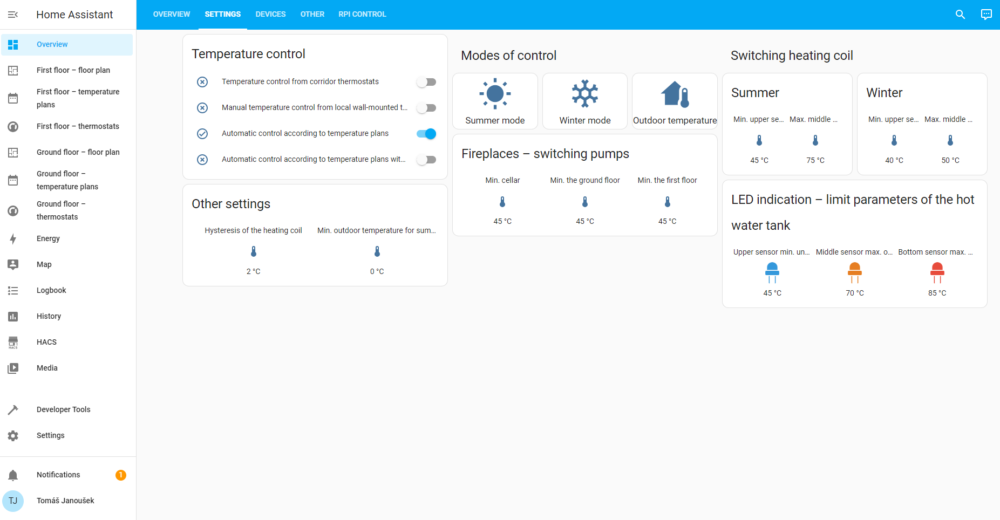
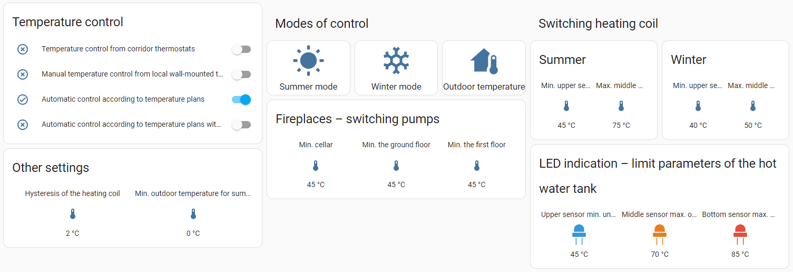

# System for underfloor heating v2.0

The system for regulation of zone heating of family house. Proposed control system is based on Raspberry Pi with the Home Assistant system. The unit is fully controllable via web. Devices for controlling individual parts of the heating zone control and local room temperature sensors were selected or made within the system.

This version 2.0 is based on [my diploma thesis](https://dspace.cvut.cz/handle/10467/99223). This version is fully redesigned. 

- [Czech manual](https://github.com/RomLab/system-for-underfloor-heating-v2.0/blob/main/manual/manual-cz.pdf)
- English manual is in preparation.

I have made all devices in the workroom [MacGyver SH](https://macgyver.siliconhill.cz/) (I used measuring devices, tools and others). Mr. [bkralik](https://github.com/bkralik) helped me with the milling work of a box (the part Installation box – type 2).

## Description of the overall concept
There is a heating system of house in the picture 1. The source of heat is a fireplace in the cellar, on the ground floor and on the first floor. All the fireplaces have a heat exchanger. The fireplaces with heat exchanger are for heating of heating water which flows through the fireplace insert. This fireplace insert recharges a hot water tank (HWT). On the ground floor and on the first floor is a distributor of underfloor heating with 12 heating circuits. Each heating circuit can be controlled independently. There is a pump and a manual three-way mixing valve for settings optimal temperature for underfloor heating. The first source of heat is a heating coil. The heating coil is used for heating of heating water in the summer season (for heating of domestic hot water (DHW)), the fireplaces are not used). Both sources of heat are for heating of heating water in central tank (volume is 1 500 l). In the upper one third of the height of the tank is installed container for the DHW (volume is 120 l). The system controls pumps in the distributors of underfloor heating, the pumps for fireplaces with heat exchanger and drives for individual circuit of underfloor heating. If there is a request for heating in a room, the pumps will be controlled. If somebody makes a fire in a fireplace, the selected pump by the fireplace will be turned on.

Picture 1: Heating system in the house.

### Hardware part
There is hardware concept in the picture 2.

Picture 2: Hardware concept.

Central control unit is single board computer. 

The first is wireless wall-mounted room temperature sensors (WRTS) are powered from local power adapters, every module has own supply. WRTS is composed of display for showing current temperature and required temperature and other settings. There are 3 buttons. The first is for increase required temperature. The second is for input into menu and the last is for decrease temperature. The last part is a temperature sensor. WRTS communicates with the central control unit via WiFi.

The second is cable wall-mounted room temperature sensors (WRTS) are powered from switch with POE. All parts are same as Wireless WRTS. The cable WRTS communicates with central control unit via POE switch.

The status indicator is connected with the central control unit. It is composed of LED for individually temperatures which are measured from individually parts in HWT. There is a bus for a communication with LCD and the central control unit for showing temperatures from the tank. The status indicators are located by the fireplaces.

The switches unit is composed of relay modules for control individual pumps for circulation heating water in heating circuit of underfloor heating in individual floors. There is controlling for pumps for circulation of water from the fireplace exchanger. Last control is forthe heating coil.

The zone controller is located in the ground floor and in the first floor in distributor for individual heating circuits.  The zone controller communicates with the central control unit via a bus. The zone controller controls individual drives, the drives control individual heating circuits. The drives are connected directly to zone controller.

The network devices are composited of a central switch, a switch with POE abd home WiFi router. The central switch merge all communication from cable WRTSs and from wireless WRTSs.

The temperature sensors in HWT are located in three parts of tank (the top part, the middle part and the bottom part). There are temperatures sensors in smoke flues at individual fireplaces for detection of heating in a fireplace.

### Communication part
There is communication concept in the picture 3.

Picture 3: Communication part.

The communication between the central control unit and wireless/cable WRTS is via protocol MQTT. The central control unit receives information from individual WRTS. Some settings for WRTS is possible to change in the central control unit and sends this settings to WRTS.

The status indicators communicate with the central control unit via I2C bus for showing values on a display. The indication LED are connected in input/output pins of the central control unit.

The switching unit is connected to the central control unit for control of the pumps underfloor heating, the pumps for fireplace exchangers and the heating coil.

The zone controller communicates with the central control unit via I2C bus. The zone controller controls heating circuits.

The temperature sensors are located in the HWT, on smoke flue of fireplaces and outdoor temperature. All sensors communicate with the central control unit via 1-Wire bus.

## Hardware part
In the picture 4 is drawing of heating system with individual devices for control this system. In the text are descripted individual selected or designed devices which are described in the drawing. In the text is the description of WRTS.

Picture 4: The Heating system in the house including control electronics.

### Central control unit Raspberry Pi
In the picture 5 is the cutout of part from all drawing (the picture 4) for central control unit. The central control unit is Raspberry Pi model 4b.

Picture 5: The cutout from the picture 4 – the central control unit.

Picture 6: The top part of PCB of the central control unit. The central control unit with a case, rear side, front side, left side and right side.

---
 [More pictures](pictures-of-final-products/central-control-unit)

---
**PCB and 3D models:**

* [PCB in KiCAD, Gerber data, …](https://github.com/RomLab/pcb-system-for-underfloor-heating-v2.0/tree/main/central-control-unit)
* [3D models of box in FreCAD, STEP files, GCODE for Prusa's printer, …](https://github.com/RomLab/3d-model-system-for-underfloor-heating-v2.0/tree/main/electric-switchboard/central-control-unit)
---

### Temperature sensors

Picture 7: The cutout from the picture 4 – location of temperature sensors by a fireplace.

In the picutre 7 is cutout of part from all drawing (the picture 4) for location temperature sensors by a smoke flue. To obtain the temperature from the smoke flue is a thermocouple 72-21301041 type K from manufacture Güenther. The temperature range is from -100 °C to 400 °C. The thermocouple is in the picture 9.

In the picture 8 is cutout of part from all drawing (the picture 4) for location temperature sensor in the HWT. To obtain the temperature from the central HWT, outdoor temperature and room temperature from individual rooms is temperature sensor DS18B20 from manufacture Maxim. The temperature range is from -55 °C to +125 °C. It is used sensors in a package TO-92 for the WRTS, for the HWT and outdoor temperature. The sensor is stored in protection package.

Picture 8: The cutout from the picture 4 – location of temperature sensors in the heating water tank.

Picture 9: Thermocouple 72-21301041 type K.

#### 1-Wire bus
The 1-Wire bus is implemented via UTP cable category 5e. 

Picture 10: The cutout from the picture 4 – location of merge 1-Wire bus by the HWT.

In the picture 10 is cutout of part from all drawing (the picture 4) for merge 1-Wire bus by HWT. In the picture 11 is a PCB for temperature sensor by HWT. In the picutre 4.6b is a top part PCB which is located in an installation box. There are 6 position for fastening via a terminal block for temperature sensors. There are 3 temperature sensors connect for obtain the temperature from the top, middle and bottom part HWT. The location of sensor is given manufacture of tank and sensors are inserted to cavity. The 1-Wire bus is implemented with a UTP cable category 5e. The pin 4 is Data, pin 5 is GND and 3 pin is supply voltage. To obtain the temperature is sensor DS18B20 in the package TO-92 which is connected on the UTP cable and covered plastic material and covered with a shrink protective tube. In the picture 12 are marked places with location of temperature sensors.

Picture 11: The merge of 1-Wire bus by the HWT.

Picture 12: The HWT – the red circles indicate the location of the temperature sensors.

### I2C bus

The I2C bus is realized with integrated circuit PCA9615 from manufacture NXP Semiconductors. The signal SCL and SDA is connected directly from the central control unit to input PCA9615, supply voltage is 3.3 V.  The output from PCA9615 is differential signal. The power supply on this side is 5 V. The bus is implemented via UTP cable category 5e, output form PCA9615 is implemented  via RJ45 connector. The UTP cable and differential transmission allows reach a long distance bus. The longest point of bus is about 30 m. The frequency is used 100 kHz. It is therefore the full-fledged I2C bus.
The reason for choosing this variant is based on the choice of a display with an I2C bus (simple and cheap solution). It is a classic connection of the display, as if it were located by a small distance from the central control unit and it is not necessary transfer as RS485 to UART and then to I2C bus. The communication is defined via the I2C protocol. The one PCA9615 is located by central control unit and other PCA9615 are located in the end of connected the devices.
The power supply 5 V is implemented via a separated cable. In the one UTP is the 1-Wire bus and the I2C bus - saving cables. 

## Signalization by fireplace

Picture 13: The cutout from the picture 4 – signalization by the fireplace.

In the picture 13 is cutout of part from all drawing (the picture 4) for signalization of status by the fireplace. The PCB is composed from electronic fuse TPS2600 for protection 5 V. All input/output connectors have a ESD protection (TVS diodes). The 1-Wire and the I2C bus are connected via UTP cable (connector RJ45). There are terminal blocks for LED signalization of accumulated HWT. The blue LED is for the top part of tank, the orange LED is for the middle part of tank and the red LED is for bottom part of tank.

Temperature measurement using a thermocouple and a MAX31850K converter. The temperature sensors connected to the smoke flues of the fireplace are implemented using the thermocouple. The termocouple is connected to integrated circuit MAX31850K, value from the thermocouple is transferred to digital value including low temperature compensation end and this value is send via 1-Wire bus. The thermocouple is type K.

### LCD display
For showing temperatures from the bottom, middle and top part of HWT is selected 20 characters and 4 rows LCD display with blue backlight and white letters, the picture 14. The HD44780 controller is used to control the display. The I2C expander PCF8574 is connected to the controller with eight outputs which are connected on data bus for control respectively displaying the character on the display. Each display or PCF8574 expander allows to set a unique device address on the bus using jumpers A0, A1, A2.

Picture 13: The LCD display for displaying of temperatures from the HWT. The rear and top part of LCD.

### Realized PCB of signalization by fireplace

Picture 15: The realized PCB of signalization by fireplace. The bottom part of PCB without the LCD, the bottom part of PCB with the LCD and the top part of PCB.

### Installation box
**Type 1**

It is used a [installation box](https://eshop.sez-cz.cz/e-shop/3597-universalni-krabice-pod-omitku-200x200x70mm?cat_id=129) (SEZ manufacturer, EAN 8585027005075) only the (orange) rear part. The top part is printed from 3D printer.

All electronics are located in a protective installation box (the picture 16). The box includes two wires for voltage 5 V and ground, three cables for controlling the signaling LEDs, an UTP cable with the 1-Wire bus for the temperature sensor (thermocouple) and the I2C bus.

Picture 16: The panel type 1. The panel with the bottom PCB. The panel with the top PCB. All installation by a fireplace.

**Type 2**

It is used a [installation box](https://www.gme.cz/v/1511578/u-01-26-instalacni-krabice) (Vigan manufacturer, EAN 90317), the picture 17. The holder for the PCB top printed from 3D printer. his printed part is pasted with epoxy adhesive.

Picture 17: The panel type 2. The panel with the bottom PCB. The panel with the top PCB.

---
 [More pictures](/pictures-of-final-products/signalization-by-fireplace)

---
**PCB and 3D models:**

* [PCB in KiCAD, Gerber data, …](https://github.com/RomLab/pcb-system-for-underfloor-heating-v2.0/tree/main/signalization-by-fireplace)
* [3D models of box in FreCAD, STEP files, GCODE for Prusa's printer, …](https://github.com/RomLab/3d-model-system-for-underfloor-heating-v2.0/tree/main/signalization-by-fireplace)
---

## Zone controller

Picture 18: The cutout from the picture 4 – the zone controller.

In the picture 18 is cutout of part from all drawing (the picture 4) for the zone controller. The zone controller is composited from integrated circuit PCA9615 for realization the I2C bus via differential pairs. The bus is implemented using category 5e UTP cable. The PCA9615 is connected with PCA9685 from company NXP Semiconductors. The outputs from PCA9685 control individual thermoelectric drives (total of 12 drives, each controlled independently). This drives respectively valves control individual circuits. The zone regulators are located in the distributor of the heating circuits on the ground floor and on the first floor of the house.

### Realized PCB of zone controller

Picture 19: The realized PCB of the zone controller. The bottom part of PCB and the top part of PCB.

### Case

  

Picture 20: The panel with the top PCB. The top of part panel. The panel with the bottom shield. The front side of the panel with the shield. The right side of the panel with the shield.

### Thermoelectric drives Salus T30NC

In the picture 21 is a Salus T30NC thermoelectric drive is used for control valves for individual heating circuits. It is supply with 24 V DC, maximum current peak when turn on it is 250 mA. Operating power is 2 W. The thread size is M30 × 1.5 mm. Maximum valve stem stroke length is 4 mm. The drive force is 100 N (±10%). The time for opening is approximately 2 minutes. It is type of NC (Normally Closed). When the power is off, the valve is closed. The 12 of these drives are used for each floor.

Picture 21: The thermoelectric drive Salus T30NC.

---
 [More pictures](/pictures-of-final-products/zone-controller)

---
**PCB and 3D models:**

* [PCB in KiCAD, Gerber data, …](https://github.com/RomLab/pcb-system-for-underfloor-heating-v2.0/tree/main/zone-controller)
* [3D models of box in FreCAD, STEP files, GCODE for Prusa's printer, …](https://github.com/RomLab/3d-model-system-for-underfloor-heating-v2.0/tree/main/zone-controller)
---

## Digital corridor thermostats

Picture 22: The cutout from picture 4 – the digital corridor thermostats.

In the picture 22 is the cutout of part from all drawing (the picture 4) for digital corridor thermostats. To obtain temperatures from individual floors in corridors are used digital thermostat marked as W3230. The thermostat has one switching output (if heating is required, the output is switched on otherwise it is switched off). It is possible to set hysteresis, time delay, temperature calibration and maximum temperature range. It is also possible to activate a signal that is triggered when the maximum permissible temperature is reached. For the power supply is 12 V DC. To obtain temperature is used NTC thermistor. The temperature range is -40 °C to 120 °C. The measurement accuracy is ± 0.1 °C. The thermostat can be replaced by another thermostat with output relay.

## SSR relay modules

Picture 23: The cutout from picture 4 – SSR relays.

In the picture 23 is cutout of part from all drawing (the picture 4) for SSR relays. For switching pumps by fireplaces and in the distributor of the heating circuits are used SSR relay ASR-M05DA-1 (input volatege 5–32 V DC, output voltage 24–280 V AC, max. output current 5 A, zero-cross), more info at https://www.anly.com.tw/en/productDia.php?id=146. For switching of the heating coil (6 kW, star connection) is used SSR relay SRH3-1430 (input volatege 4–30 V DC, output voltage 48–280 V AC, max. output current 30 A, zero-cross), more info at https://www.autonicsonline.com/product/product&product_id=13943&tag=SRH3-1430.

## Electric switchboard with the central control unit

In the picture 24 is cutout of part from all drawing (the picture 4) for electric switchboard with the central control unit. In the electric switchboard are located 5 V supply voltage (MDR-60-5) for power supply the central control unit, the signilization by the fireplaces and zone controllers. The supply voltage 5 V (DR-15-5) is for status signal for the corridor thermostats. The next supply voltage is 12 V (HDR-30-12) for power supply the corridor thermostats and fans inside electric switchboard. The supply voltage 12 V (HDR-15-12) is for switching of external devices (SSR relays). The power supply 24 V (S8VK-C12024) for power supply the zone controllers (thermoelectric drives). There are circuit breakers for pumps and power supply. There are [breakdown list and dimensional drawing of the electric switchboard](documentation-of-electric-switchboard/export-pdf/en/breakdown-list-and-dimensional-drawing.PDF) and [single pole diagram of the electric switchboard](documentation-of-electric-switchboard/export-pdf/en/single-pole-diagram.pdf) (It was used software from Eaton E-config.).

Picture 24: The cutout from picture 4 – the electric switchboard.

Picture 25: The final electric switchboard.

## Wall-mounted room temperature sensor

To obtain room temperature is the WRST. These devices primary serve to measure temperature a its sending into the central control unit. There are buttons for settings required temperature (step change is 0.5 °C) for a selected room. On a display is showing currently measuredly and requiredly temperature. If somebody does changes in central system, this changes will does in the WRST. The WRST measures temperature in the room every 30 seconds. If the WRST disconnects from network connection, the device will do reconnection. This network failure is displayed in the central control unit. The first option of communication with the central control unit is via Ethernet and the end devices are powered by POE. The second option of communication with the central control unit is via WiFi and the end devices are powered by a power adapter. In the house are 6 devices with Ethernet and 5 devices with WiFi.

### Variant with Ethernet

Picture 26: The cutout from the  picture 4 – the wall mounted room temperature sensor – Ethernet.

In the picture 26 is cutout of part from all drawing (the picture 4) for WRST (variant with Ethernet). In the picture 27 is a block diagram of the NSPT where it is communication via Ethernet and the end devices are powered by POE. The device is powered from PSE (Power Sourcing Equipment) - POE switch MaxLink PSAT-10-8P-250, the WRST is PD (Powered Device). This PSE and PD devices support standart 802.3af respectively 802.3at. The devices PD are set for the lowest power class 1 (max. power PSE for PD devices is 4 W). For transmission is used Phantom voltage. Input voltage from PSE (44-57 V depending on the length of the UTP cable and lossed) passes through a diode rectifier. There is control circuit TPS23753A which provides communication/interface for correct settings and enable voltage from the PSE. It alose provides control of the conversion of input voltage to output voltage 5 V (DC-DC converter). It is connected in the Flyback topology. The feedback is solved using optical feedback with an adjustable Zener diode TLV431A in the comparator connection.

The device in operation is primarily powered by 5 V, in the case of programming the device, it is possible to use a programming connector with a power pin for 5 V. If POE is available, power from the programming connector will be blocked (using a P-channel MOSFET). The 5 V voltage is conducted to two LDO (Low-dropout regulator) regulators. The one LDO serves only to power the ESP-32-WROVER-IE (M213EH2864UH3Q0) module, the second LDO is to power the remaining peripherals (display, buttons, temperature sensor, circuit for the physical layer of Ethernet W5500).

For programming the module, there is a connector for connecting an external module, where there are pins for the TX/RX signal from the UART and signals for automatic reset and boot of the module, and pins for the 5 V power supply and ground.In addition, there are buttons for boot and reset of the ESP32 module located directly on the PCB, without depending on the connection of the programming module (so other modules that do not have automatic reset and boot can also be programmed).

The device has protective transils on the connectors and parts which are in direct contact with the user. The circuit for POE has also current and temperature protection. The LDO regulators have low input voltage detection for successful start-up, thermal fuse and protection when the output voltage increases compared to the input voltage. 

There is a color TFT display of size 2.2" (240×320 pixels) with an ILI9341 controller for displaying the current and required temperature. The display is connected to the ESP32 module using the SPI bus. The display has the option of controlling the backlight using PWM. The W5500 circuit is used for the physical layer which implements an Ethernet controller with integrated TCP/IP. The circuit is connected to the ESP32 module using the SPI bus. To obtain room temperature is used temperature sensor DS18B20. There are three buttons for settings the required temperature and showing the menu.

The ESP32 module has an RMII (Reduced Media-Independent Interface) interface which has a more complex software implementation and uses a larger number of pins. Therefore, the integrated circuit W5500 is chosen. Two independent SPI buses are used for communication. The one is between the ESP32 module and the W5500. The second is between the ESP32 module and the display.

In the picture 28 is the top part of the realized PCB for the WRST, the bottom part of PCB and the PCB with display. 

Picture 27: The block diagram of wall-mounted room temperature sensor – Ethernet.

  

Picture 28: The realized PCB of the wall mounted room temperature sensor – Ethernet. The PCB bottom part. The PCB top part. The PCB top part with display.

### Variant with WiFi

Picture 29: The cutout from the  picture 4 – the wall mounted room temperature sensor – WiFi.

In the picture 29 is cutout of part from all drawing (the picture 4) for WRST (variant with WiFi). In the picture 30 is a block diagram of the WRST communicates via WiFi and powered by a power adapter (Mean Well GSM06E05-P1J). This variant does not have power supply by POE and the circuit W5500 with implementing Ethernet communication as the variant above.

In the picture 31 is the top part realized PCB for the WRST with WiFi. In the picture 30 is the bottom part realized PCB. In the picture 30 is PCB with the display. 

Picture 30: The block diagram of wall-mounted room temperature sensor – WiFi.

  

Picture 31: The realized PCB of the wall mounted room temperature sensor – WiFi. The PCB bottom part. The PCB top part. The PCB top part with display.

#### Box for the wall-mounted room temperature sensor
The box for the WRST is printed on the 3D printer Prusa i3 MK3s (the picture 32). The plastic is used PET-G. The box has size 130 × 99 × 26 mm. The box for both the version with Ethernet and for WiFi is the same, it differs only in the connector for RJ45 and the DC connector for the adapter.

Picture 32: The Box for the wall-mounted room temperature sensor.

---
 [More pictures](pictures-of-final-products/wall-mounted-room-temperature-sensor)

---
**PCB and 3D models:**

* [Ethernet – PCB in KiCAD, Gerber data, …](https://github.com/RomLab/pcb-system-for-underfloor-heating-v2.0/tree/main/wall-mounted-room-temperature%20sensor-ethernet)
* [Wifi – PCB in KiCAD, Gerber data, …](https://github.com/RomLab/pcb-system-for-underfloor-heating-v2.0/tree/main/wall-mounted-room-temperature%20sensor-wifi)
* [3D models of box in FreCAD, STEP files, GCODE for Prusa's printer, …](https://github.com/RomLab/3d-model-system-for-underfloor-heating-v2.0/tree/main/wall-mounted-room-temperature-sensor)
---

## Converter USB-UART CP2102N

For programming the WRST, modul ESP32 Wrover-IE is used converter USB-UART CP2102N. It is used a module CP2102N MINEK (the picture 33). The module is supplemented with a transistor connection for automatic reset and automatic boot of the module (the picture 33). The DTR (Data Terminal Ready) and RTS (Request To Send) signals are used from the module. If it needs to enter the bootloader to upload new firmware, it is necessary to hold boot and then press reset, the device is thus ready to upload new firmware. From the module are brought out to a connector 5 V, GND, RXD, TXD, EN and IO0. Communication between the CP2102N and the ESP32 is via the RXD and TXD wires.

Picture 33: The converter USB-UART CP2102N. The bottom part of converter. The top part of converter. 

## Software part

### Wall-mounted room temperature sensor

The WRST still checks that it is connected to network (it is connected cable or it is available WiFi). If it is not connected, it tries to reconnect. The connection status is indicated to the user by an icon in the left corner (green color of the icon for a successful connection status, red color indicates a connection problem). The device checks the connection to the MQTT broker (Mosquitto broker), similarly to the network connection, the device tries to restore the connection automatically. The status is again signaled using the icon in the left corner. The current measured temperature is shown in red on the display (measured every 30 seconds), the required temperature is shown in green. The user can increment the temperature by +0.5 °C with the right button, the left button decrements it by -0.5 °C. The middle button has not implemented function yet. It will be for next settings for example hysteresis. The last line with white text is used to display a message to the user. Currently it displayed request for flooding in a fireplace. The individual parts described above are showed in the picture 34.

Picture 34: Wall-mounted room temperature sensor – software. 

### Home Assistant - Types of heating control
Within the control system, there are the following control types:
- Heating control according to corridor thermostats.
- Heating control according to wall room temperature sensors.
- Heating control according to temperature plans.

It is assumed that the central the HWT is continuously heated during a day using excess energy through heat exchangers. The central HWT is reheated for any heating needs. Priority is given to obtaining heated heating water from the heat source mentioned earlier. Users are alerted by signals on the displays both at the fireplaces (the picture 16) and at the WRST (the picture 34). Directly in the control system (notifications to the mobile phone (the picture 35), e-mail are also possible) or by LEDs (lighting of all) by fireplaces, there is a need to flood the fireplaces, if the system evaluates that there is a need for heating. If this does not happen, the heating coil is used, which reheats the HWT (it can be controlled automatically). 

Picture 35: Notification for users. 

In the picture 36 is interface Home Assistant for settings of heating. In the left menu  are individual floors with thermostats and temperature schedules (described below). In the records tab, history are saved to a database individual states of the control elements and the history of the data itself, especially of the temperature sensors. There are also settings for the user profile and the entire system. In the top menu are other tabs for heating settings, also described below in the text.

Picture 36: Interface Home Assistant for settings of heating.

In the overview tab (the picture 37) are displayed current temperatures which are used for evaluation in the system Home Assistant. In the section "individual temperatures" are all temperatures measured in the HWT, temperatures on flues in the ground and first floor and outdoor temperature. In the section "temperature comparison" are mentioned temperatures displayed in the one graph.

Picture 37: The current temperatures which are used for evaluation in the system Home Assistant.

In the settings tab (the picture 38) is possible to select one type of heating control in the "temperature control" section. In the "control modes" is selection of modes - winter, summer or selection according to outdoor temperature. The choice of mode has affect on selection limit temperatures for switching the heating coil. Temperature limits can be set in the section "switching of heating coil" (temperature limits for summer and winter). These set limits are used for control with the temperature in the upper part of the HWT.

If temperature in the top part of the HWT is lower than temperature defined in the part "min. turn on", the heating coil will be switched on to heat the heating water. The boiler switches off at the temperature defined in the "max. turn off". When comparing temperatures is used hysteresis in the section "other settings". In the mode according to outdoor temperature is selected automatic the summer or winter mode. The temperature limit for selection of the summer mode (within the mode according to the outdoor temperature) is defined in the section "min. outdoor temperature for the summer mode". If after warning of users, it won't be flooding in the boiler. The boiler will automatically turn on.

In the section of settings "fireplaces - switching of pump" is defined min. temperature limit when the circulation pumps for heat exchangers of fireplaces are switched on. In case of flooding in the fireplace, the pumps must be started, otherwise water in the heat exchanger will overheat. If overheating occurs, the protection is activated by the fireplaces and an audible alarm will sound.

In the section "LED indication - limit parameters of the heating water tank" are defined the limit temperatures for the top, middle and bottom part of the HWT. This indication is for users for signalization of heating of the HWT. The blue LED defines the limit minimum temperature that the tank should have in the top part. The orange LED defines the limit maximum temperature when the middle part of the HWT is enough heating. The red LED defines maximum temperature when the bottom part of the HWT is fully heating. Activation of the red LED is before activating of protection of fireplace.

Picture 38: Tab settings. 

In the device tab (the picture 39) is showing individual control (turn on/turn off) devices of heasting system - the heating coil, pumps for fireplaces, pumps for underfloor heating and signalization LEDs. The switch "manual device control" is for individual control of devices regardless of the automation.

In the section "corridor thermostats - required heating" is showing of heating in the ground or first floor according to corridor thermostats.

In the section "floor/ground floor - heating circuits (valves)" is showing on status of each valve.

Picture 39: Tab devices. 

In other tab in the part "control of pumps – limescale"  (the picture 40) is used to switch pumps for protection before stiffening shoulder blades. If the pumps are not used for long time, the vanes will become stiff.

Picture 40: Control of pumps – limescale.

### Heating control according to corridor thermostats

In the ground and first floor are corridor thermostats. This thermostat controls independent on settings in the central control unit turn on/turn off a output relay when it is need to heating. This request is subsequently evaluated in the central system and then the  pump for underfloor heating is turned on or turned off and all underfloor heating circuits are opened. All rooms are heated same according to one thermostat.

### Heating control according to wall room temperature sensors

According to current temperature measured from each rooms is controlled given heating circuit for heating. The required temperature is possible to set on the WRST or in the system (the picture 41). The changes are reflected in each other. Room heating control is given by a hysteresis of 0.5 °C. The heating control responds to the current measured temperature.

Picture 41: Thermostat. 

Local thermostats are sorted to groups according to given floor (the ground floor or the first floor), the picture 42.

Picture 42: Thermostats. 

Each the thermostat has indication of network connection to the central control unit. Verification takes based on sending the current time. There is detection of open window in a room.

### Heating control according to temperature plans

The heating control according to defined schedules. The user has the option to define time periods with required temperature for each room for all 24 hours. The time schedules set are continuously checked by the system and the system sets the currently required temperature to local WRSTs. This temperature is showed in HA thermostat. The interface for settings of intervals is in the picture 41. The user can add individual interval or remove it. The user can choose whether intervals are applied to all days of the week or just working days, the weekend or selection of specific days of the week. It is possible to define whether the given section should be heated or not.

Picture 41: The interface for settings of intervals. 

For each room is possible to define individual count of intervals. The overview of individual plans is displayed under each day, the picture 42. 

Picture 42: Individual count of intervals. 

????
Individual plans can also be paused using the slider button on the right. The general overview of the temperature plans of all rooms for the first floor is possible to see in the picture 43, similar overview is for the ground room.

Picture 43: Overview of the temperature plans of all rooms. 

### Recharging of domestic hot water
 
Recharging of the (domestic hot water) is similar as heating according to temperature plans. There is one temperature plan recharging for DHW. There is comparison required temperature with the current temperature in the top part of the HWT. If temperature is low, the system will alert users to flood the fireplace. If they do not do so within a certain time, the heating coil will automatically turn on and heat the top part of the HWT.

### Heating control according to temperature plans with adjustment according to the weather forecast
Description  is in preparation.

---
**Software + settings:**

* [Software (scripts) Home Assistant + AppDaemon](https://github.com/RomLab/home-assistant-for-underfloor-heating-docker-v2.0)
* [Software for the wall-mounted room temperature sensors](https://github.com/RomLab/esp32-local-thermostat)
---
