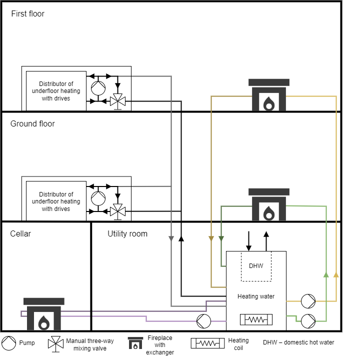
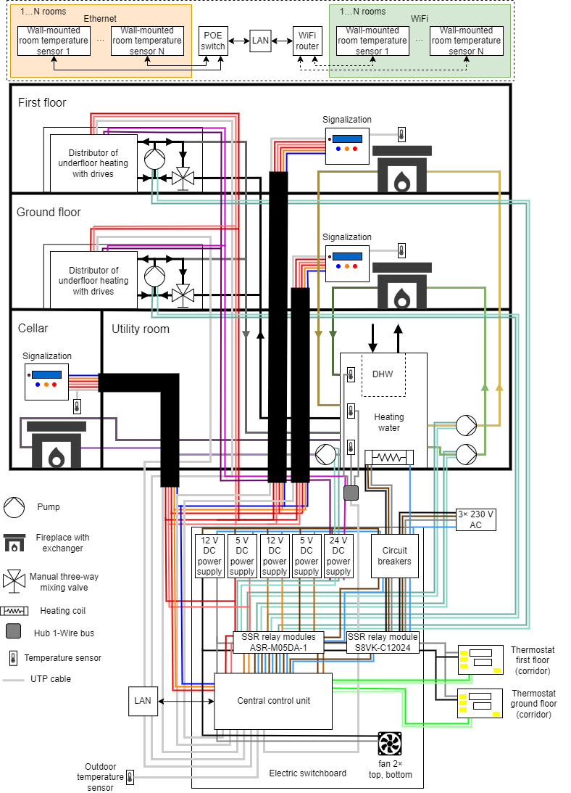
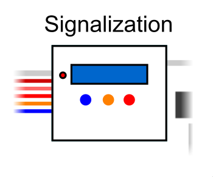
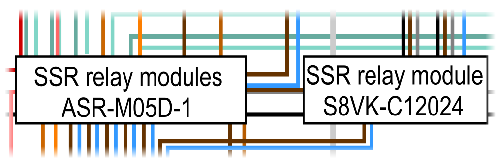

# System for underfloor heating v2.0

The system for regulation of zone heating of family house. Proposed control system is based on Raspberry Pi with the Home Assistant system. The unit is fully controllable via web. Devices for controlling individual parts of the heating zone control and local room temperature sensors were selected or made within the system.

## Description of the overall concept
There is a heating system of house in the picture 1. The source of heat is fireplace in the cellar, on the ground floor and on the first floor. All the fireplaces have a heat exchanger. The fireplaces with heat exchanger are for heating of heating water which flows through fireplace insert. This fireplace insert recharges hot water tank (HWT). In the ground floor and in the first floor is distributor of underfloor heating with 12 heating circuit. Every the heating circuit is possible to control independent. There is pump and manual three-way mixing valve for settings optimal temperature in underfloor heating. The first source of heat is a heating coil. This heating coil will use for heating of heating water in the summer season (for heating of domestic hot water (DHW)), where the fireplaces will not to use. -> The heating coil is used for heating of heating water in the summer season (for heating of domestic hot water (DHW)) when the fireplaces are not used. The both source of heat are for heating of heating water in central tank (volume is 1 500 l). In the upper one third of the height of the tank is installed container for DHW (volume is 120 l).  The system controls pumps in the distributors of underfloor heating, the pumps for fireplaces with heat exchanger and drives for individual circuit of underfloor heating. If there is request for heating from a room, the pumps will be controlled. If somebody makes a fire in a fireplace, the selected pump by the fireplace will be turn on.

Picture 1: Heating system in the house.

### Hardware part
There is hardware concept in the picture 2.

Picture 2: Hardware concept.

Central control unit is single board computer. 

The first is wireless wall-mounted room temperature sensors (WRTS) are powered from local power adapters, every module has own supply. WRTS is composed of display for showing current temperature and required temperature and other settings. There are 3 buttons. The first is for increase required temperature. The second is for input into menu and the last is for decrease temperature. The last part is a temperature sensor. WRTS communicates with the central control unit via WiFi.

The second is cable wall-mounted room temperature sensors (WRTS) are powered from switch with POE. All parts are same as Wireless WRTS. The cable WRTS communicates with central control unit via POE switch.

The status indicator is connected with the central control unit. It is composed of LED for individually temperatures which are measured from individually parts in HWT. There is a bus for a communication with LCD and the central control unit for showing temperatures from the tank. The status indicators are located by the fireplaces.

The switches unit is composed of relay modules for control individual pumps for circulation heating water in heating circuit of underfloor heating in individual floors. There is controlling for pumps for circulation of water from the fireplace exchanger. Last control is forthe heating coil.

The zone controller is located in the ground floor and in the first floor in distributor for individual heating circuits.  The zone controller communicates with the central control unit via a bus. The zone controller controls individual drives, the drives control individual heating circuits. The drives are connected directly to zone controller.

The network devices are composited of a central switch, a switch with POE abd home WiFi router. The central switch merge all communication from cable WRTSs and from wireless WRTSs.

The temperature sensors in HWT are located in three parts of tank (the top part, the middle part and the bottom part). There are temperatures sensors in smoke flues at individual fireplaces for detection of heating in a fireplace.

### Communication part
There is communication concept in the picture 3.

Picture 3: Communication part.

The communication between the central control unit and wireless/cable WRTS is via protocol MQTT. The central control unit receives information from individual WRTS. Some settings for WRTS is possible to change in the central control unit and sends this settings to WRTS.

The status indicators communicate with the central control unit via I2C bus for showing values on a display. The indication LED are connected in input/output pins of the central control unit.

The switching unit is connected to the central control unit for control of the pumps underfloor heating, the pumps for fireplace exchangers and the heating coil.

The zone controller communicates with the central control unit via I2C bus. The zone controller controls heating circuits.

The temperature sensors are located in the HWT, on smoke flue of fireplaces and outdoor temperature. All sensors communicate with the central control unit via 1-Wire bus.

## Hardware part
In the picture 4 is drawing of heating system with individual devices for control this system. In the text are descripted individual selected or designed devices which are described in the drawing. In the text is the description of WRTS.

Picture 4: The Heating system in the house including control electronics.

### Central control unit Raspberry Pi
In the picture 5 is the cutout of part from all drawing (the picture 4) for central control unit. The central control unit is Raspberry Pi model 4b.

Picture 5: The coutout from the picture 4 – the central control unit.

### Temperature sensors

Picture 6: The cutout from thr picture 4 – location of temperature sensors by a fireplace.

In the picutre 6 is cutout of part from all drawing (the picture 4) for location temperature sensors by a smoke flue. To obtain the temperature from the smoke flue is a thermocouple 72-21301041 type K from manufacture Güenther. The temperature range is from -100 °C to 400 °C. The thermocouple is in the picture 8.

In the picture 7 is cutout of part from all drawing (the picture 4) for location temperature sensor in the HWT. To obtain the temperature from the central HWT, outdoor temperature and room temperature from individual rooms is temperature sensor DS18B20 from manufacture Maxim. The temperature range is from -55 °C to +125 °C. It is used sensors in a package TO-92 for the WRTS, for the HWT and outdoor temperature. The sensor is stored in protection package.

Picture 7: The cutout from the picture 4 – location of temperature sensors in the heating water tank.

Picture 8: Thermocouple 72-21301041 type K.

#### 1-Wire bus
The 1-Wire bus is implemented via UTP cable category 5e. 

Picture 9: The cutout from the picture 4 – location of merge 1-Wire bus by the HWT.

In the picture 9 is cutout of part from all drawing (the picture 4) for merge 1-Wire bus by HWT. In the picture 10 is a PCB for temperature sensor by HWT. In the picutre 4.6b is a top part PCB which is located in an installation box. There are 6 position for fastening via a terminal block for temperature sensors. There are 3 temperature sensors connect for obtain the temperature from the top, middle and bottom part HWT. The location of sensor is given manufacture of tank and sensors are inserted to cavity. The 1-Wire bus is implemented with a UTP cable category 5e. The pin 4 is Data, pin 5 is GND and 3 pin is supply voltage. To obtain the temperature is sensor DS18B20 in the package TO-92 which is connected on the UTP cable and covered plastic material and covered with a shrink protective tube. In the picture 11 are marked places with location of temperature sensors.

Picture 10: The merge of 1-Wire bus by the HWT.

Picture 11: The HWT – the red circles indicate the location of the temperature sensors.

### I2C bus

The I2C bus is realized with integrated circuit PCA9615 from manufacture NXP Semiconductors. The signal SCL and SDA is connected directly from the central control unit to input PCA9615, supply voltage is 3.3 V.  The output from PCA9615 is differential signal. The power supply on this side is 5 V. The bus is implemented via UTP cable category 5e, output form PCA9615 is implemented  via RJ45 connector. The UTP cable and differential transmission allows reach a long distance bus. The longest point of bus is about 30 m. The frequency is used 100 kHz. It is therefore the full-fledged I2C bus.
The reason for choosing this variant is based on the choice of a display with an I2C bus (simple and cheap solution). It is a classic connection of the display, as if it were located by a small distance from the central control unit and it is not necessary transfer as RS485 to UART and then to I2C bus. The communication is defined via the I2C protocol. The one PCA9615 is located by central control unit and other PCA9615 are located in the end of connected the devices.
The power supply 5 V is implemented via a separated cable. In the one UTP is the 1-Wire bus and the I2C bus - saving cables. 

## Signalization by fireplace

Picture 12: The cutout from the picture 4 – signalization by the fireplace.

In the picture 12 is cutout of part from all drawing (the picture 4) for signalization of status by the fireplace. The PCB is composed from electronic fuse TPS2600 for protection 5 V. All input/output connectors have a ESD protection (TVS diodes). The 1-Wire and the I2C bus are connected via UTP cable (connector RJ45). There are terminal blocks for LED signalization of accumulated HWT. The blue LED is for the top part of tank, the orange LED is for the middle part of tank and the red LED is for bottom part of tank.

Temperature measurement using a thermocouple and a MAX31850K converter. The temperature sensors connected to the smoke flues of the fireplace are implemented using the thermocouple. The termocouple is connected to integrated circuit MAX31850K, value from the thermocouple is transferred to digital value including low temperature compensation end and this value is send via 1-Wire bus. The thermocouple is type K.

### LCD display
For showing temperatures from the bottom, middle and top part of HWT is selected 20 characters and 4 rows LCD display with blue backlight and white letters, the picture 13. The HD44780 controller is used to control the display. The I2C expander PCF8574 is connected to the controller with eight outputs which are connected on data bus for control respectively displaying the character on the display. Each display or PCF8574 expander allows to set a unique device address on the bus using jumpers A0, A1, A2.

Picture 13: The LCD display for displaying of temperatures from the HWT. The rear and top part of LCD.

### Realized PCB of signalization by fireplace

Picture 14: The realized PCB of signalization by fireplace. The bottom part of PCB without the LCD, the bottom part of PCB with the LCD and the top part of PCB.

### Installation box
**Type 1**

It is used a [installation box](https://eshop.sez-cz.cz/e-shop/3597-universalni-krabice-pod-omitku-200x200x70mm?cat_id=129) (SEZ manufacturer, EAN 8585027005075) only the (orange) rear part. The top part is printed from 3D printer.

All electronics are located in a protective installation box (the picture 15). The box includes two wires for voltage 5 V and ground, three cables for controlling the signaling LEDs, an UTP cable with the 1-Wire bus for the temperature sensor (thermocouple) and the I2C bus.

Picture 15: The panel type 1. The panel with the bottom PCB. The panel with the top PCB. All installation by a fireplace.

**Type 2**

It is used a [installation box](https://www.gme.cz/v/1511578/u-01-26-instalacni-krabice) (Vigan manufacturer, EAN 90317), the picture 16. The holder for the PCB top printed from 3D printer. his printed part is pasted with epoxy adhesive.

Picture 16: The panel type 2. The panel with the bottom PCB. The panel with the top PCB.

---
 [More pictures](/pictures-of-final-products/signalization-by-fireplace)

---
**PCB and 3D models:**

* [PCB in KiCAD, Gerber data, …](https://github.com/RomLab/pcb-system-for-underfloor-heating-v2.0/tree/main/signalization-by-fireplace)
* [3D models of box in FreCAD, STEP files, GCODE for Prusa's printer, …](https://github.com/RomLab/3d-model-system-for-underfloor-heating-v2.0/tree/main/signalization-by-fireplace)
---

## Zone controller

Picture 17: The cutout from the picture 4 – the zone controller.

In the picture 17 is cutout of part from all drawing (the picture 4) for the zone controller. The zone controller is composited from integrated circuit PCA9615 for realization the I2C bus via differential pairs. The bus is implemented using category 5e UTP cable. The PCA9615 is connected with PCA9685 from company NXP Semiconductors. The outputs from PCA9685 control individual thermoelectric drives (total of 12 drives, each controlled independently). This drives respectively valves control individual circuits. The zone regulators are located in the distributor of the heating circuits on the ground floor and on the first floor of the house.

### Realized PCB of zone controller

Picture 18: The realized PCB of the zone controller. The bottom part of PCB and the top part of PCB.

### Case

  

Picture 19: The panel with the top PCB. The top of part panel. The panel with the bottom shield. The front side of the panel with the shield. The right side of the panel with the shield.

### Thermoelectric drives Salus T30NC

In the picture 20 is a Salus T30NC thermoelectric drive is used for control valves for individual heating circuits. It is supply with 24 V DC, maximum current peak when turn on it is 250 mA. Operating power is 2 W. The thread size is M30 × 1.5 mm. Maximum valve stem stroke length is 4 mm. The drive force is 100 N (±10%). The time for opening is approximately 2 minutes. It is type of NC (Normally Closed). When the power is off, the valve is closed. The 12 of these drives are used for each floor.

Picture 20: The thermoelectric drive Salus T30NC.

---
 [More pictures](/pictures-of-final-products/zone-controller)

---
**PCB and 3D models:**

* [PCB in KiCAD, Gerber data, …](https://github.com/RomLab/pcb-system-for-underfloor-heating-v2.0/tree/main/zone-controller)
* [3D models of box in FreCAD, STEP files, GCODE for Prusa's printer, …](https://github.com/RomLab/3d-model-system-for-underfloor-heating-v2.0/tree/main/zone-controller)
---

## Digital corridor thermostats

Picture 21: The cutout from picture 4 – the digital corridor thermostats.

In the picture 21 is the cutout of part from all drawing (the picture 4) for digital corridor thermostats. To obtain temperatures from individual floors in corridors are used digital thermostat marked as W3230. The thermostat has one switching output (if heating is required, the output is switched on otherwise it is switched off). It is possible to set hysteresis, time delay, temperature calibration and maximum temperature range. It is also possible to activate a signal that is triggered when the maximum permissible temperature is reached. For the power supply is 12 V DC. To obtain temperature is used NTC thermistor. The temperature range is -40 °C to 120 °C. The measurement accuracy is ± 0.1 °C. The thermostat can be replaced by another thermostat with output relay.

## SSR relay modules

Picture 22: The cutout from picture 4 – SSR relays.

In the picture 22 is cutout of part from all drawing (the picture 4) for SSR relays. For switching pumps by fireplaces and in the distributor of the heating circuits are used SSR relay ASR-M05DA-1 (input volatege 5–32 V DC, output voltage 24–280 V AC, max. output current 5 A, zero-cross), more info at https://www.anly.com.tw/en/productDia.php?id=146. For switching of the heating coil (6 kW, star connection) is used SSR relay SRH3-1430 (input volatege 4–30 V DC, output voltage 48–280 V AC, max. output current 30 A, zero-cross), more info at https://www.autonicsonline.com/product/product&product_id=13943&tag=SRH3-1430.

## Electric switchboard with the central control unit

In the picture 23 is cutout of part from all drawing (the picture 4) for electric switchboard with the central control unit. In the electric switchboard are located 5 V supply voltage (MDR-60-5) for power supply the central control unit, the signilization by the fireplaces and zone controllers. The next supply voltage is 12 V (HDR-30-12) for power supply the corridor thermostats and fans inside electric switchboard. 
The power supply 24 V (S8VK-C12024) for power supply the zone controllers (thermoelectric drives). There are circuit breakers for pumps and power supply.

Picture 23: The cutout from picture 4 – the electric switchboard.

